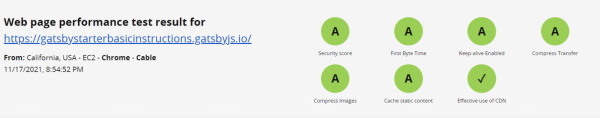

## About Basic Instructions Starter

This is a Gatsby Starter with everything you need for a professional website.

- Correct Per-Page Meta/SEO using `react-helmet`
- GDPR with `gatsby-plugin-gdpr-cookies` and `react-cookie-consent`
- Sitemap
- Site Manifest
- PWA
- Full Text Search with (Optional Image Search)
- Professional Page Scrolling
- Tags and Categories
- SSR and DSG Examples

## Dependency's

```json
    "@gatsby-contrib/gatsby-plugin-elasticlunr-search": "^3.0.2",
    "@react-icons/all-files": "^4.1.0",
    "@theme-ui/color": "^0.12.0",
    "babel-plugin-prismjs": "^2.1.0",
    "gatsby": "^4.2.0",
    "gatsby-plugin-anchor-links": "^1.2.1",
    "gatsby-plugin-catch-links": "^4.2.0",
    "gatsby-plugin-feed": "^4.2.0",
    "gatsby-plugin-gatsby-cloud": "^4.2.0",
    "gatsby-plugin-gdpr-cookies": "^2.0.8",
    "gatsby-plugin-image": "^2.2.0",
    "gatsby-plugin-manifest": "^4.2.0",
    "gatsby-plugin-offline": "^5.2.0",
    "gatsby-plugin-react-helmet": "^5.2.0",
    "gatsby-plugin-sass": "^5.2.0",
    "gatsby-plugin-sharp": "^4.2.0",
    "gatsby-plugin-sitemap": "^5.2.0",
    "gatsby-plugin-theme-ui": "^0.12.1",
    "gatsby-remark-autolink-headers": "^5.2.0",
    "gatsby-remark-copy-linked-files": "^5.2.0",
    "gatsby-remark-embed-video": "^3.1.1",
    "gatsby-remark-images": "^6.2.0",
    "gatsby-remark-prismjs": "^6.2.0",
    "gatsby-remark-responsive-iframe": "^5.2.0",
    "gatsby-remark-smartypants": "^5.2.0",
    "gatsby-schema-field-absolute-path": "^1.3.0",
    "gatsby-source-filesystem": "^4.2.0",
    "gatsby-transformer-remark": "^5.2.0",
    "gatsby-transformer-sharp": "^4.2.0",
    "lodash": "^4.17.21",
    "node-sass": "^6.0.1",
    "path": "^0.12.7",
    "prismjs": "^1.25.0",
    "react": "^17.0.2",
    "react-cookie-consent": "^6.4.1",
    "react-dom": "^17.0.2",
    "react-helmet": "^6.1.0",
    "rehype-react": "^7.0.3",
    "theme-ui": "^0.12.1"

    Dev Dependency's

    "prettier": "^2.4.1"
```

> **Update** [Basic Instructions Hosted on Gatsby Cloud](https://gatsbystarterbasicinstructions.gatsbyjs.io/) is now built with Gatsby V4 "4.2.0", this includes many performance updates with Latest Gatsby!

GatsbyJS Version @latest with all the @latest modules from npm.

[](https://badge.fury.io/js/gatsby) 

gatsby-plugin-image With the Plugins proper usage.

* * *

# Gatsby Version 4.2.0

[](https://app.netlify.com/start/deploy?repository=https://www.gatsbyjs.com)


### Gatsby Starter Basic Instructions

Kick off your project with this blog boilerplate. This starter ships with the main Gatsby configuration files you might need to get up and running blazing fast with the blazing fast app generator for React.

## Speed Tests

Based on Gatsby Cloud Tests

Both Scores below Reflect the usage of Large Images, with Google Tags Analytics and utterances external scripts.

### Lighthouse


### Web Page Test



_Have another more specific idea? You may want to check out our vibrant collection of [official and community-created starters](https://www.gatsbyjs.com/docs/gatsby-starters/)._

## 🚀 Quick start

1.  **Create a Gatsby site.**

    Use the Gatsby CLI ([install instructions](https://www.gatsbyjs.com/docs/tutorial/part-0/#gatsby-cli)) to create a new site, specifying the blog starter.

    ```shell
    # create a new Gatsby site using the blog starter
    gatsby new my-blog-starter https://github.com/donaldboulton/gatsby-starter-basic-instructions
    ```

1.  **Start developing.**

    Navigate into your new site’s directory and start it up.

    ```shell
    cd my-blog-starter/
    gatsby develop
    ```

1.  **Open the source code and start editing!**

    Your site is now running at `http://localhost:8000`!

    _Note: You'll also see a second link: _`http://localhost:8000/___graphql`_. This is a tool you can use to experiment with querying your data. Learn more about using this tool in the [Gatsby Tutorial](https://www.gatsbyjs.com/docs/tutorial/part-4/#use-graphiql-to-explore-the-data-layer-and-write-graphql-queries)._

    Open the `my-blog-starter` directory in your code editor of choice and edit `src/pages/index.js`. Save your changes and the browser will update in real time!

## 🚀 Quick start (Gatsby Cloud)

Deploy this starter with one click on [Gatsby Cloud](https://www.gatsbyjs.com/cloud/):

[](https://www.gatsbyjs.com/dashboard/deploynow?url=https://github.com/donaldboulton/gatsby-starter-basic-instructions)

## 🧐 What's inside?

A quick look at the top-level files and directories you'll see in a Gatsby project.

    .
    ├── node_modules
    ├── src
    ├── .gitignore
    ├── .prettierrc
    ├── gatsby-browser.js
    ├── gatsby-config.js
    ├── gatsby-node.js
    ├── gatsby-ssr.js
    ├── LICENSE
    ├── yarn-lock
    ├── package.json
    └── README.md

1.  **`/node_modules`**: This directory contains all of the modules of code that your project depends on (npm packages) are automatically installed.

2.  **`/src`**: This directory will contain all of the code related to what you will see on the front-end of your site (what you see in the browser) such as your site header or a page template. `src` is a convention for “source code”.

3.  **`.gitignore`**: This file tells git which files it should not track / not maintain a version history for.

4.  **`.prettierrc`**: This is a configuration file for [Prettier](https://prettier.io/). Prettier is a tool to help keep the formatting of your code consistent.

5.  **`gatsby-browser.js`**: This file is where Gatsby expects to find any usage of the [Gatsby browser APIs](https://www.gatsbyjs.com/docs/reference/config-files/gatsby-browser/) (if any). These allow customization/extension of default Gatsby settings affecting the browser.

6.  **`gatsby-config.js`**: This is the main configuration file for a Gatsby site. This is where you can specify information about your site (metadata) like the site title and description, which Gatsby plugins you’d like to include, etc. (Check out the [config docs](https://www.gatsbyjs.com/docs/reference/config-files/gatsby-config/) for more detail).

7.  **`gatsby-node.js`**: This file is where Gatsby expects to find any usage of the [Gatsby Node APIs](https://www.gatsbyjs.com/docs/reference/config-files/gatsby-node/) (if any). These allow customization/extension of default Gatsby settings affecting pieces of the site build process.

8.  **`gatsby-ssr.js`**: This file is where Gatsby expects to find any usage of the [Gatsby server-side rendering APIs](https://www.gatsbyjs.com/docs/reference/config-files/gatsby-ssr/) (if any). These allow customization of default Gatsby settings affecting server-side rendering.

9.  **`LICENSE`**: This Gatsby starter is licensed under the 0BSD license. This means that you can see this file as a placeholder and replace it with your own license.

10. **`package-lock.json`** (See `package.json` below, first). This is an automatically generated file based on the exact versions of your npm dependencies that were installed for your project. **(You won’t change this file directly).**

11. **`package.json`**: A manifest file for Node.js projects, which includes things like metadata (the project’s name, author, etc). This manifest is how npm knows which packages to install for your project.

12. **`README.md`**: A text file containing useful reference information about your project.

## 💫 Deploy

[Build, Deploy, and Host On The Only Cloud Built For Gatsby](https://www.gatsbyjs.com/products/cloud/)

Gatsby Cloud is an end-to-end cloud platform specifically built for the Gatsby framework that combines a modern developer experience with an optimized, global edge network.

## 👌 Features

- A Blog and Personal website with Netlify CMS.
- Responsive Web Design
- Using Theme-Ui for structure and styles
- Dark / Light Mode
- Blog Posts Tags Pages with a added component
- Blog Posts Categories Pages with a added component
- Using Remark-Rehype to add Html or Modules to Blog Posts Markdown Pages
- Customize theme color from CMS
- Search bar
- Customize content of Homepage, About and Contact page.
- Add / Modify / Delete blog posts.
- Edit website settings, Add Google Analytics and make it your own all with in the CMS.
- SEO Optimized
- Social media icons
- OpenGraph structured data
- Twitter Cards meta
- Beautiful XML Sitemaps, for now hand built
- Robots.txt
- Netlify Contact Form, Works right out of the box after deployment.
- Invite collaborators into Netlify CMS, without giving access to your Github account via Git Gateway
- Gatsby Incremental Builds with Netlify.
- Images with gatsby-plugin-image

## 🚀 Quick Deploy

Just click on the **Deploy to Netlify** button.

This would fork `gatsby-starter-basic-instructions` to your Github account and start building your website on [Netlify](https://netlify.com). Once the deployment is done. Your website will be live and website address would look like **site-name.netlify.app**

[](https://app.netlify.com/start/deploy?repository=https://github.com/donaldboulton/gatsby-starter-basic-instructions)

## ⚙ Access to Netlify CMS


### Netlify Cms will not work on Gatsby Cloud

- Install Below
- Goto app.netlify.com > select your website from the list
- Goto identity and Click **Enable Identiy**
- Click on **Invite Users** and invite yourself. You will receive an email and you need to accept the invitation to set the password.
- Now headover to Settings > Identity > Services and **Enable Git Gateway**
- You can also manage who can register and log in to your CMS. Goto Settings > Identity > Registration >Registration Preferences. I would prefer to keep it to **Invite Only**, if i am the only one using it.
- Now, goto to **site-name.netlify.app/admin/**, and login with your credentials.

## ⛭ Installation of CMS

> gatsby-plugin-netlify-cms Version @latest

> netlify-cms-app Version @latest

```shell
yarn add gatsby-plugin-netlify-cms netlify-cms-app gatsby-plugin-netlify-cms-paths
```

### gatsby.config file add

```bash
{
  resolve: 'gatsby-plugin-netlify-cms',
  options: {
    modulePath: `${__dirname}/src/cms/cms.js`,
  },
},
```

### CMS file in src/cms

Add to initialize **netlify-cms-app** as a folder under src/cms/cms.js

```js
import CMS from "netlify-cms-app"

export default {
  CMS,
}
```

### The Configuration file

Change /static/admin/config.yml file to your site needs. 

> Otherwise its tailored for this Configuration!